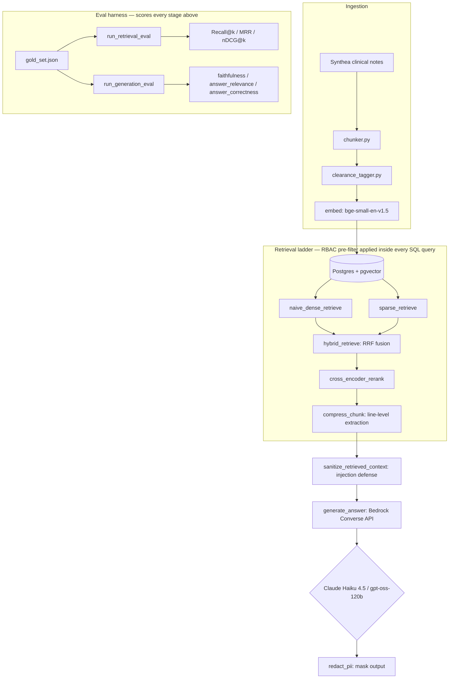
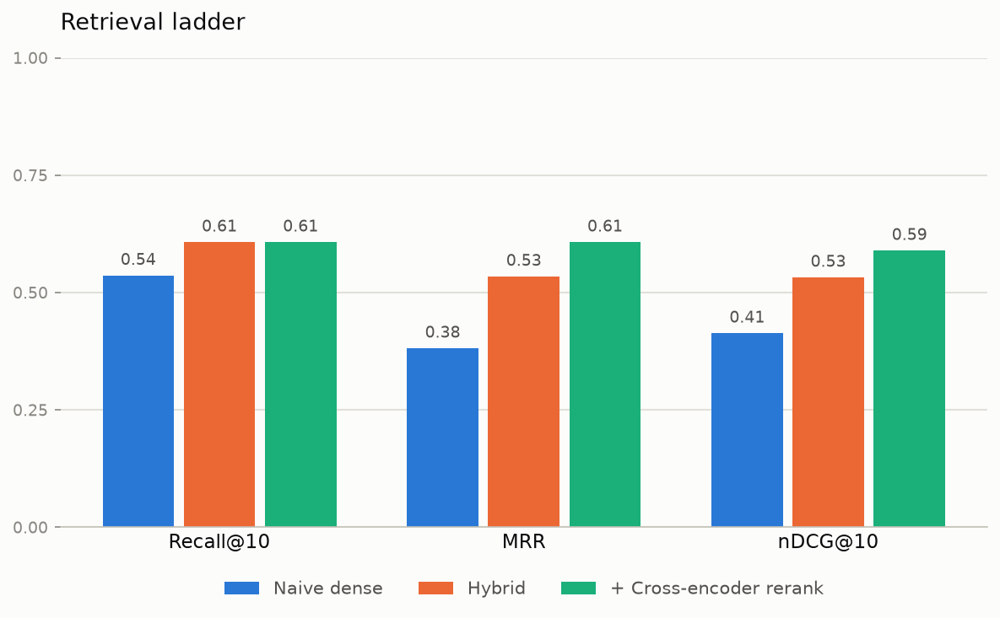
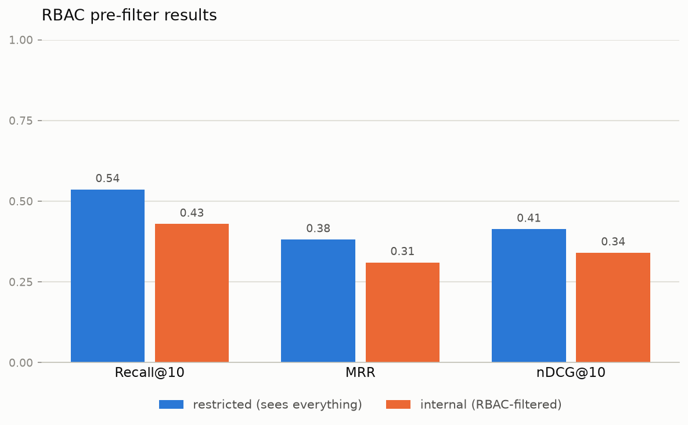
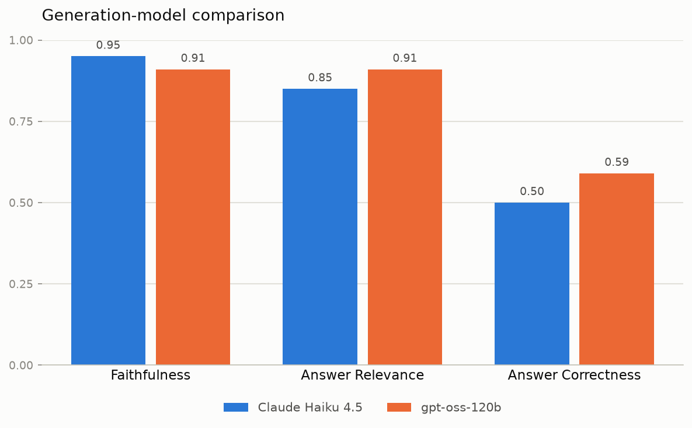

# Secure Multi-Technique RAG

A Retrieval-Augmented Generation system built over a synthetic, access-controlled medical corpus — designed around a question most RAG portfolios skip: **what happens when different users are legally allowed to see different slices of the same data?**

The project has two goals, deliberately paired: (1) benchmark a ladder of retrieval techniques (naive dense → hybrid → reranked → compressed) against a frozen, hand-verified gold set, and (2) build a real security layer — role-based access control enforced *inside* the retrieval query, hand-rolled PII detection, and prompt-injection defense — that a production healthcare RAG system would actually need before it could ship.

**Status: core system complete.** The full retrieval ladder, the entire security layer, and a generation-model comparison are all built and benchmarked end-to-end against a real corpus with real queries — see the results below. Bedrock Guardrails/Knowledge Base comparisons, FastAPI serving, and a larger gold set are planned next (see [`PROGRESS.md`](PROGRESS.md) for the live build checklist).

## Why this domain

The corpus is synthetic medical records (generated with [Synthea](https://github.com/synthetichealth/synthea)) rather than a generic document set, because HIPAA's "minimum necessary" rule gives access control a genuine reason to exist here: a nurse, a biller, and a behavioral-health specialist are supposed to see different parts of the same patient's chart. That constraint shapes the whole security design — access control is enforced as a metadata pre-filter *inside* the vector query, never a post-filter, because post-filtering would let restricted content pass through retrieval, logging, and reranking before being dropped, silently leaking its existence.

## Architecture



## What's built and tested so far

**Data pipeline** (`src/rag/ingest/`)
- Structure-aware chunker that parses Synthea's per-encounter clinical notes into section-level chunks (`chunker.py`)
- Clearance-tier tagging: a section-based default with a **fail-closed** fallback (an unrecognized section defaults to the *most* restrictive tier, not the least) plus keyword-based escalation for sensitive content that shows up regardless of section — e.g. an abuse-related finding filed under a routine `CONDITIONS` section still gets escalated (`clearance_tagger.py`)
- Ground-truth PII span labeling, using Synthea's own known identifier values rather than guessing (`pii_labeler.py`)

**Security** (`src/rag/security/`)
- A hand-rolled PII detector combining regex for structured PII (dates, SSNs, phone numbers) with a naive Title-Case heuristic for names — deliberately kept naive to demonstrate *why* regex-only PII detection fails on unstructured text: it misses Synthea's own digit-suffixed synthetic names entirely, while false-positively flagging facility names. Both failure modes are captured as explicit regression tests, not swept under the rug (`pii_redaction.py`)
- RBAC pre-filter: `allowed_tiers()` computes every clearance tier at or below a user's own rank, which every retrieval function's SQL query then filters on directly (`WHERE clearance_tier = ANY(%s)`) *before* ranking happens — never a post-filter. `user_clearance` is a required parameter with no default on every retrieval function, deliberately: a security-critical parameter defaulting to "see everything" would be a fail-*open* bug waiting to happen (`access_filter.py`)

  ```mermaid
  graph LR
      subgraph "This project: pre-filter"
          A1[Query + user_clearance] --> B1["WHERE clearance_tier = ANY(allowed_tiers)\nORDER BY embedding <=> query"]
          B1 --> C1[Only allowed chunks are ever ranked, logged, or returned]
      end

      subgraph "Common mistake: post-filter"
          A2[Query] --> B2["ORDER BY embedding <=> query\n(no clearance filter)"]
          B2 --> C2[Top-k results, restricted chunks included]
          C2 --> D2[Drop restricted chunks after the fact]
          D2 --> E2["Restricted content already touched ranking,\nlogs, and the reranker before being dropped"]
      end
  ```
- Prompt-injection defense: a hand-rolled detector (`detect_injection_patterns`) flags instruction-override phrasing ("ignore previous instructions"), role-play override attempts ("you are now..."), and fake system/assistant turn markers planted inside retrieved text, plus a sanitizer (`sanitize_retrieved_context`) that redacts matched spans before they reach the prompt. Deliberately naive, same tradeoff as the PII detector — a documented test shows a simple rephrasing evades it entirely (`injection_defense.py`)
- PII redaction: `redact_pii` turns `detect_pii`'s spans into actually-masked output text, replacing right-to-left (sorted by start index, descending) so masking one span never corrupts the character indices of spans still waiting to be replaced (`pii_redaction.py`)

**Evaluation harness** (`src/rag/eval/`) — built *before* any retrieval technique, so every technique that follows is measured on identical ground:
- Retrieval metrics: Recall@k, MRR, nDCG@k, implemented from the formulas rather than a library, each with edge cases (empty ground truth, `k` beyond the result count) explicitly handled
- Security metrics: access-control leakage rate, injection-defense success rate, PII-redaction recall
- A pluggable harness (`harness.py`) that scores any retrieval function against the gold set — the same harness runs unchanged for every rung of the retrieval ladder, you just swap the function passed in

**Gold set** (`data/gold/gold_set.json`) — 14 hand-drafted queries against real corpus chunks, spanning both routine clinical facts and `restricted`-tier content (substance-use screening, an intimate-partner-abuse finding), including one multi-chunk query. This is a *pilot* set for getting the pipeline working end-to-end; the plan is to expand toward 50-100 verified queries before final benchmark numbers are reported.

**Retrieval** (`src/rag/retrieval/`)
- Naive dense retrieval — rung 1: embeds the query with the same model used to embed the corpus (`BAAI/bge-small-en-v1.5`), then ranks chunks by cosine distance via pgvector's `<=>` operator directly in SQL (`dense.py`)
- Hybrid retrieval — rung 2: combines dense retrieval with keyword-based search via Postgres full-text search (`sparse_bm25.py`), merged with Reciprocal Rank Fusion (`fusion_rrf.py`). Each sub-retriever pulls a wider candidate pool (50) before fusion narrows to the final top-k, so a chunk ranked outside one method's top-10 can still surface if the other method ranks it highly (`hybrid.py`)
- Cross-encoder reranking — rung 3: takes hybrid's top-50 candidate pool and scores each `(query, chunk_text)` pair directly with `cross-encoder/ms-marco-MiniLM-L-6-v2`, a slower but more accurate model than the bi-encoder used for dense retrieval, since it reasons about the query and candidate jointly rather than comparing precomputed vectors (`rerank.py`)
- Contextual compression — rung 4: extracts (not summarizes) the most query-relevant lines out of an already-retrieved chunk by embedding each line and comparing it to the query, the same bi-encoder similarity math as dense retrieval, just applied at line-level instead of chunk-level. Doesn't change which chunks get retrieved, so it isn't a new row in the retrieval benchmark table below — its payoff is shorter, cleaner context for the eventual generation step (`compression.py`)

**Infrastructure**: Postgres + pgvector (metadata filtering inside the ANN query is the whole reason this vector store was chosen over alternatives that don't support it well), the full corpus embedded and loaded (91,969 chunks across 200 synthetic patients), `uv`-managed environment, `pytest` suite covering every module above.

## Preliminary results

Scored against the 14-query pilot gold set:

| Technique | Recall@10 | MRR | nDCG@10 |
|---|---|---|---|
| Naive dense (baseline) | 0.536 | 0.381 | 0.413 |
| Hybrid (dense + keyword, RRF) | 0.607 | 0.534 | 0.532 |
| + Cross-encoder rerank | **0.607** | **0.607** | **0.589** |



Hybrid improves on every metric over naive dense — MRR jumps the most (+40% relative), consistent with RRF's design: a chunk that ranks well in *either* method gets rewarded, which most directly helps "does the right answer land near the top" rather than just "does it appear somewhere in the top 10."

Reranking's result is a clean, structurally-expected one: **Recall@10 doesn't move at all** between hybrid and reranking, because reranking only *reorders* the same 50-candidate pool hybrid already found — it can't surface a chunk hybrid missed entirely. What it *does* improve is MRR (+14% relative) and nDCG@10 (+11% relative), because it pushes already-found correct chunks higher within that pool. That's exactly the marginal effect reranking is supposed to have, and the benchmark table shows it directly rather than just asserting it.

**Read these as early signal, not final numbers** — the gold set is a 14-query pilot (target is 50-100 hand-verified queries before this table is treated as authoritative). One concrete, expected failure mode already observed: patients with many repeat encounters produce several near-duplicate chunks (the same medication mentioned across multiple visits), so a query can retrieve the *right patient's* correct content from the *wrong specific encounter* rather than the exact chunk labeled in the gold set — a plausible source of some of the recall misses here.

Also worth naming honestly: "hybrid" here uses Postgres full-text search (`ts_rank`) rather than the literal BM25 formula, and required converting its default AND-matching into OR-matching to behave like a real ranked retriever rather than an all-or-nothing filter — a deliberate, documented deviation, not an oversight (see `PROGRESS.md`'s improvement log for details).

Contextual compression (rung 4) is built and verified but deliberately doesn't add a fifth row here — it doesn't change which chunks are retrieved, only trims their content, so its actual payoff (shorter context for generation) isn't visible until generation metrics exist.

### RBAC pre-filter results

Naive dense retrieval, same 14-query gold set, scored per role:

| Clearance | Recall@10 | MRR | nDCG@10 |
|---|---|---|---|
| `restricted` (sees everything) | 0.536 | 0.381 | 0.413 |
| `internal` (can't see `restricted`-tier chunks) | **0.429** | **0.310** | **0.340** |



`restricted`'s numbers are identical to the very first unfiltered benchmark this project ever produced — expected, since filtering to "everything at or below the top tier" is filtering to nothing at all. `internal`'s numbers are meaningfully lower, because the 5 gold-set queries targeting `restricted`-tier content (substance-use screening, an intimate-partner-abuse finding) become unanswerable for that role — not because retrieval got worse, but because those chunks are now correctly invisible before ranking ever happens. That's the pre-filter design working exactly as intended, measured rather than just asserted.

### Generation-model comparison

Two Bedrock models (`generate_answer()`, Converse API) scored against the full 14-query gold set via hand-rolled LLM-as-judge metrics (`src/rag/eval/generation_metrics.py`) — no RAGAS/DeepEval dependency, same "implement from the concept" approach as the retrieval metrics. Retrieval context for this run came from `naive_dense_retrieve` (the baseline rung); Claude Haiku 4.5 acted as judge for both models.

| Model | Faithfulness | Answer Relevance | Answer Correctness |
|---|---|---|---|
| Claude Haiku 4.5 | 0.95 | 0.85 | 0.50 |
| gpt-oss-120b | 0.91 | 0.91 | 0.59 |



Three distinct metrics, deliberately: **faithfulness** (is the answer grounded in the context it was actually given, i.e. no hallucination) and **answer relevance** (does the answer address the question asked) are both *reference-free* — they never look at the gold set's hand-written `reference_answer`. **Answer correctness** is the one metric that does, checking whether the generated answer actually conveys the same information as the known-correct answer.

That distinction is the whole story in this table: faithfulness and relevance both look strong for both models (~0.85-0.95), which on its own would read as "the system works well." Answer correctness tells a different, more honest story — both models land around 0.5-0.6, because `naive_dense_retrieve` itself fails to surface the right chunk on a meaningful fraction of queries (see the retrieval ladder's own recall numbers above). A model can be perfectly faithful to the *wrong* retrieved context and still be flatly incorrect — faithfulness/relevance alone would have hidden that failure completely; answer correctness is what surfaces it. Re-running this same generation benchmark against the better retrieval rungs (hybrid, cross-encoder rerank) rather than the naive baseline is the natural next measurement, since the retrieval ladder's own numbers suggest those rungs should close much of this gap.

One limitation worth naming directly: Haiku judges both models' answers, including its own — a single fixed judge keeps the comparison internally consistent, but a model judging its own output is a known potential source of self-favoring bias.

### Worked example: when good-looking metrics hide a real failure

A real trace from the gold set, showing exactly why three generation metrics exist instead of two:

> **Query:** "What condition was diagnosed for this patient on 2024-04-20?"
> **Gold-set reference answer:** "Acute viral pharyngitis"
>
> **Retrieved context** (`naive_dense_retrieve`, k=3) — wrong patient entirely:
> ```
> 2024-07-13 : Gingivitis (disorder)
> 2024-07-13 : Ischemic heart disease (disorder)
> 2024-07-13 : Alzheimer's disease (disorder)
> ...
> ```
>
> **Generated answer** (Claude Haiku 4.5): *"Based on the provided medical records, there is no condition documented for this patient on 2024-04-20. The earliest documented date in the records is 2024-07-13... **Answer: No information available for 2024-04-20**"*
>
> | Metric | Score | What it saw |
> |---|---|---|
> | Faithfulness | **1.0** | The answer is 100% consistent with the (wrong) context it was shown — no hallucination |
> | Answer Relevance | **0.85** | The answer directly addresses the question asked |
> | Answer Correctness | **0.0** | The answer is simply wrong — the real diagnosis was pharyngitis |

Retrieval failed silently here: dense embeddings are good at topical similarity ("pharyngitis" ≈ "throat infection") but bad at exact structured matching — a date string like `2024-04-20` isn't semantically meaningful to a bi-encoder the way a clinical concept is, so nothing stopped it from pulling a *different patient's* chunks entirely. The model then did the honest thing with what it was given. **Faithfulness and relevance both scored as if the system worked.** Only `answer_correctness` — the one metric that actually checks against ground truth — caught that it didn't. This is the concrete version of the aggregate gap in the table above, and the reason this project measures three things instead of two.

## What's next

- AWS Bedrock integration: Guardrails benchmarked against the hand-rolled security layer, and a Bedrock Knowledge Base as one managed-RAG baseline row
- FastAPI serving with role derived from authenticated identity, never from client input
- Expand the gold set from 14 to 50-100 hand-verified queries for more statistically meaningful benchmark numbers

## Deliberately not used (and why this matters for evaluating the project)

Every tradeoff below was a conscious scope decision, not an oversight — each one is also backed by a test or a benchmark number elsewhere in this README, not just asserted in prose.

- **No framework** (LangChain, agentic RAG, GraphRAG, Self-RAG). Orchestration is hand-rolled specifically so retrieval, fusion, and the security layer stay inspectable line-by-line rather than hidden inside a framework abstraction — the whole point of this project is to demonstrate understanding of *why* each technique works, not just call a library that does it.
- **No RAGAS/DeepEval for generation metrics.** `faithfulness`, `answer_relevance`, and `answer_correctness` are hand-rolled LLM-as-judge functions (`generation_metrics.py`), same "implement from the concept" approach as the retrieval metrics (`Recall@k`, `MRR`, `nDCG@k`). The tradeoff: a maintained library would have been faster to wire up, but the judge prompts and scoring logic here are fully inspectable rather than a black box.
- **Single ordinal clearance tier per user**, not role/attribute-based access control. `CLEARANCE_TIERS` models access as one linear scale (`public < internal < confidential < restricted`), where a real healthcare system often needs *non-nested* categories — a billing role and a behavioral-health role should see different, not strictly overlapping, slices of a chart, which an ordinal scale can't express. Kept deliberately for this project's scope (it's still a legitimate real-world pattern, e.g. classic security clearance levels), not a simplification I'm unaware of.
- **Full-text search (`ts_rank`) instead of literal BM25** for the hybrid retrieval rung, and its default AND-matching converted to OR-matching to behave like a ranked retriever rather than an all-or-nothing filter — a named, deliberate deviation (see `PROGRESS.md`'s improvement log), not a hidden approximation.
- **Regex/keyword-based PII detection and prompt-injection defense**, not an ML classifier or managed service. Both are deliberately naive, with their own false-negatives and false-positives captured as explicit regression tests rather than swept under the rug (digit-suffixed synthetic names evading the PII detector; a rephrased injection attempt evading the regex patterns). This is intentional groundwork for a planned comparison against Bedrock Guardrails — the hand-rolled baseline needs to exist, and needs its failure modes documented, before that comparison means anything.
- **One fixed judge model (Haiku) scoring both generation models**, including itself. Keeps the comparison internally consistent, but a model judging its own output is a known potential source of self-favoring bias — named directly rather than ignored.

## Running it

```bash
uv sync
docker compose up -d
docker compose exec -T postgres psql -U rag -d rag -f - < src/rag/db/schema.sql
uv run pytest tests/
```
